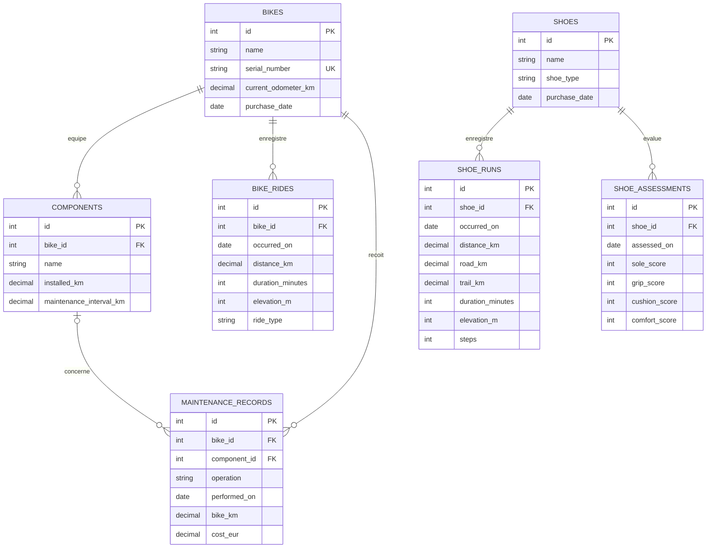

# Modèle relationnel

```mermaid
erDiagram
    BIKES ||--o{ COMPONENTS : equipe
    BIKES ||--o{ BIKE_RIDES : enregistre
    BIKES ||--o{ MAINTENANCE_RECORDS : recoit
    COMPONENTS o|--o{ MAINTENANCE_RECORDS : concerne
    SHOES ||--o{ SHOE_RUNS : enregistre
    SHOES ||--o{ SHOE_ASSESSMENTS : evalue

    BIKES {
        int id PK
        string name
        string serial_number UK
        decimal current_odometer_km
        date purchase_date
    }
    COMPONENTS {
        int id PK
        int bike_id FK
        string name
        decimal installed_km
        decimal maintenance_interval_km
    }
    BIKE_RIDES {
        int id PK
        int bike_id FK
        date occurred_on
        decimal distance_km
        int duration_minutes
        int elevation_m
        string ride_type
    }
    MAINTENANCE_RECORDS {
        int id PK
        int bike_id FK
        int component_id FK
        string operation
        date performed_on
        decimal bike_km
        decimal cost_eur
    }
    SHOES {
        int id PK
        string name
        string shoe_type
        date purchase_date
    }
    SHOE_RUNS {
        int id PK
        int shoe_id FK
        date occurred_on
        decimal distance_km
        decimal road_km
        decimal trail_km
        int duration_minutes
        int elevation_m
        int steps
    }
    SHOE_ASSESSMENTS {
        int id PK
        int shoe_id FK
        date assessed_on
        int sole_score
        int grip_score
        int cushion_score
        int comfort_score
    }
```
